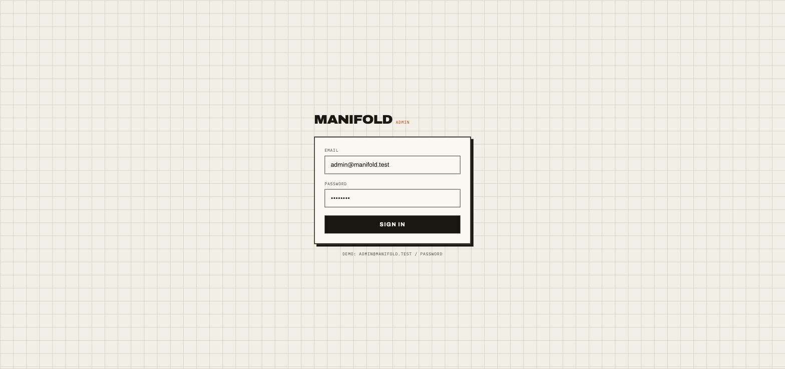
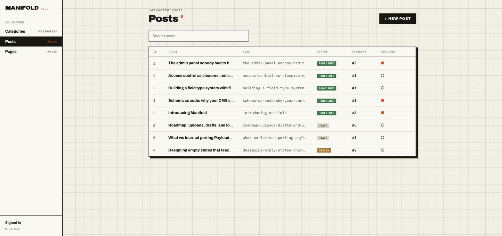
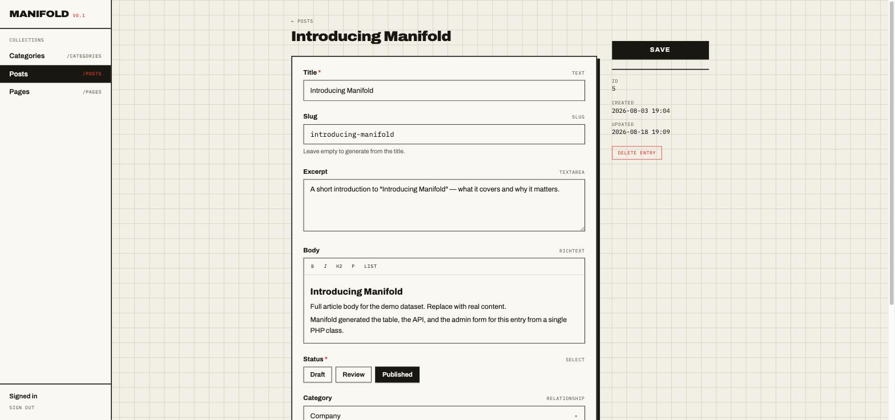
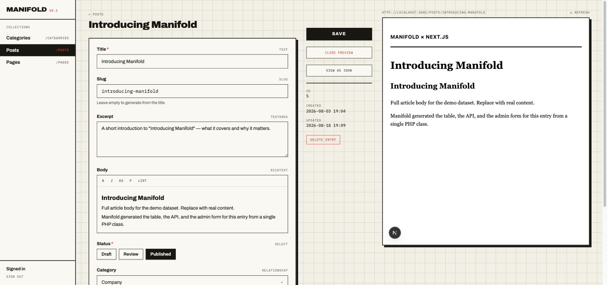

<p align="center">
  
</p>

<h1 align="center">Manifold</h1>

<p align="center">
  <a href="https://github.com/multidevagency/manifold/actions/workflows/tests.yml"></a>
</p>

<p align="center">
  <strong>A code-first headless CMS for Laravel + Nuxt.</strong><br>
  Define a collection as a PHP class — Manifold generates the database migrations,
  the REST API, and the admin UI. Nothing else to write.
</p>

---

## The idea

Payload CMS proved that "config as code" is the right model for a CMS: the schema
lives in version control, reviews happen in pull requests, and the admin panel is
a *projection* of the code rather than a thing you build. Manifold brings that
model to the Laravel + Nuxt stack.

One class:

```php
class Posts extends Collection
{
    protected string $slug = 'posts';

    public function fields(): array
    {
        return [
            Text::make('title')->required()->useAsTitle(),
            Slug::make('slug')->from('title'),
            Textarea::make('excerpt'),
            RichText::make('body'),
            Select::make('status')->options(['draft', 'review', 'published'])->default('draft')->required(),
            Relationship::make('category')->to('categories'),
            Boolean::make('featured'),
            DateTime::make('published_at')->index(),
        ];
    }

    public function access(): array
    {
        return [
            'read'   => fn ($user) => $user !== null,
            'delete' => fn ($user) => $user?->isEditor(),
        ];
    }
}
```

…gives you all of this:

| You get | How |
|---|---|
| **Real database tables** | `php artisan manifold:migrate` diffs your classes against the live schema and writes ordinary, reviewable Laravel migrations — then runs them |
| **A full REST API** | `GET/POST/PATCH/DELETE /api/manifold/posts` with pagination, search, filtering, sorting, validation, and Sanctum auth |
| **An admin panel** | The Nuxt app reads `/api/manifold/schema` and renders list views and edit forms for every collection — zero admin code per collection |
| **Access control** | Closures per operation, enforced server-side; `guestFilters()` scopes what unauthenticated visitors can read |
| **Live preview** | Point `previewUrl()` at any frontend; the admin renders it beside the edit form, drafts included |
| **A typed JS client + CLI** | `@manifold-cms/client` for any framework, `manifold types` for generated TypeScript |

<p align="center">
  
</p>

<p align="center">
  
</p>

<p align="center">
  
</p>

## Quick start

Requirements: PHP 8.3+, Composer, Node 20+, pnpm.

```bash
git clone <this repo> manifold && cd manifold

composer install
cp .env.example .env && php artisan key:generate
php artisan migrate --seed          # demo collections + demo admin user

cd admin && pnpm install && cd ..

composer dev                        # boots API, queue, logs, vite AND the Nuxt admin
```

Open **http://localhost:3000** and sign in with `admin@manifold.test` / `password`.

## The 60-second demo

Add a field to `app/Collections/Posts.php`:

```php
Number::make('reading_time')->label('Reading time (min)'),
```

Then:

```bash
php artisan manifold:migrate
```

```
  posts: add column reading_time
    -> database/migrations/2026_08_18_190251_update_mf_posts_table.php
```

Reload the admin. The field is in the form, the column is in the table, and the
API accepts it — with validation. That's the whole product.

### Schema changes are explicit, not magical

The differ generates a migration *file* you can read in review — it never mutates
the schema silently. Because a diff cannot distinguish a rename from a
drop-plus-add, renames are declared:

```php
RichText::make('content')->renamedFrom('body'),
```

which generates `renameColumn('body', 'content')` instead of destroying data.

## Field types — full Payload-style surface

**Data:** `Text` · `Textarea` · `RichText` · `Code` · `Email` · `Slug` ·
`Number` · `Boolean` · `Select` · `Radio` · `DateTime` · `Date` · `Json` ·
`Point` · `Upload` · `Relationship` · `Join` (virtual reverse relation)

**Containers (JSON):** `Group` · `ArrayField` · `Blocks` (discriminated by
`blockType`, validated server-side)

**Layout (admin-only, no columns):** `Tabs` · `Row` · `Collapsible` · `Ui`

All data fields support `required()`, `unique()`, `index()`, `default()`,
`label()`, `help()`, `rules()`, and `renamedFrom()`. The full reference lives in
the **[documentation site](docs-site/)** (`cd docs-site && pnpm dev`).

## Admin superpowers

- **Live preview** — `previewUrl()` renders any frontend beside the edit form,
  drafts included via a server-side token
- **View as JSON** — syntax-highlighted API output with copy-to-clipboard
- **✨ AI generation** — Claude writes excerpts, bodies, and meta descriptions
  from the entry's context (`ANTHROPIC_API_KEY` in `.env`, server-side only)
- **Schema editing from the UI** *(local env only)* — create collections and
  add fields; the admin writes the same PHP class you would, then migrates

## API

```
POST   /api/manifold/auth/login          -> { token, user }
GET    /api/manifold/schema              -> collections + field schemas
GET    /api/manifold/{collection}        ?page&perPage&sort&search&filter[field]=v
POST   /api/manifold/{collection}
GET    /api/manifold/{collection}/{id}
PATCH  /api/manifold/{collection}/{id}   (partial updates)
DELETE /api/manifold/{collection}/{id}
```

Auth is Laravel Sanctum bearer tokens. Every operation passes through the
collection's `access()` gates.

## Connect any frontend

Manifold is headless: unauthenticated reads are allowed wherever a collection
opts in (`'read' => fn () => true`), scoped by its `guestFilters()` — the demo
`Posts` collection exposes only `status = published` to the public. The JS
client works in Next.js, Nuxt, SvelteKit, or plain fetch:

```js
import { createClient } from '@manifold-cms/client'

const manifold = createClient({ url: 'http://localhost:8000' })
const { data: posts } = await manifold.collection('posts').list({ sort: '-published_at' })
```

A complete Next.js App Router example lives in
[`examples/nextjs-blog`](examples/nextjs-blog) — including **draft preview**
(`?preview=1` uses a server-side token, so the admin's live preview pane can
show unpublished content without exposing credentials to the browser).

```bash
cd examples/nextjs-blog
cp .env.example .env.local   # add a MANIFOLD_SERVER_TOKEN for draft previews
pnpm install && pnpm dev     # http://localhost:3002
```

### Live preview

Give a collection a preview target:

```php
public function previewUrl(): ?string
{
    return 'http://localhost:3002/posts/{slug}';
}
```

The edit view gains a **Live preview** pane rendering that URL with the entry's
values substituted, refreshed on every save — plus a **View as JSON** pane
showing exactly what the API serves.

## CLI

```bash
manifold types                       # generate TypeScript interfaces from /schema
manifold export posts -o posts.json  # dump a collection (guest-filtered without --token)
manifold import posts posts.json --token <token>
manifold init my-site                # scaffold a fresh project
```

`manifold types` turns Select options into union types:

```ts
export interface Posts {
  id: number
  title: string
  status: "draft" | "review" | "published"
  category_id: number | null
  // ...
}
```

Scaffold new collections from the Laravel side with
`php artisan make:collection Products`.

## Architecture

```
packages/manifold/          the engine (Manifold\Cms)
├── src/Fields/             field type system (fluent builders)
├── src/Collections/        Collection base class
├── src/Support/            SchemaDiffer, MigrationGenerator, EntryRepository
├── src/Http/               REST controllers
└── src/Console/            manifold:migrate

packages/client-js/         @manifold-cms/client — framework-agnostic JS SDK
packages/cli/               @manifold-cms/cli — types / export / import / init

app/Collections/            your collections (the only code you write)
admin/                      Nuxt 4 admin (schema-driven, Reka UI primitives, Tailwind v4)
examples/nextjs-blog/       Next.js frontend: blog, shop, layout-builder pages, draft preview
docs-site/                  VitePress documentation site
```

Design decisions worth knowing:

- **Real columns, not a JSON blob.** Each collection gets its own table with
  typed, indexable columns. The cost is needing a schema differ; the win is
  real FKs-ready data, real indexes, and a database a DBA can read.
- **Generated migrations over runtime DDL.** Schema changes are files in
  `database/migrations`, so they go through review and deploy like any other
  migration.
- **The admin is disposable.** It renders entirely from `/api/manifold/schema`.
  Any client could do the same — the schema endpoint is the contract.

## Tests

```bash
php artisan test
```

26 feature tests cover auth, CRUD, validation, defaults, slug generation and
collision suffixing, relationship key normalization, filtering, search,
pagination, access control, guest-filter scoping, container fields
(group/array/blocks round-trips, blockType validation, upload serialization,
layout flattening), and the schema differ (create / add / drop / rename).

## Roadmap

Honest list of what a production release still needs:

- [ ] Media library (uploads work; browsing/reuse doesn't yet)
- [ ] Child-table storage option for `ArrayField`/`Blocks` (today: JSON columns)
- [ ] Ecommerce transactions: carts, Stripe/Mollie checkout with verified
      webhooks, orders (the `Products` + variants modeling layer exists)
- [ ] Draft & publish versioning, scheduled publishing
- [ ] Localization
- [ ] Roles beyond "authenticated user" in the demo collections
- [ ] Extract `packages/manifold` to a standalone Composer package; publish the
      JS packages to npm

## License

MIT
